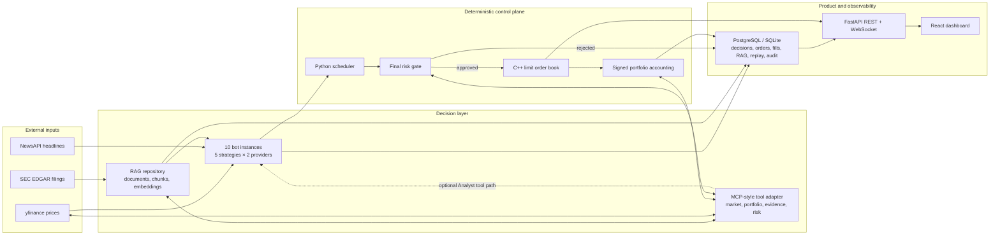
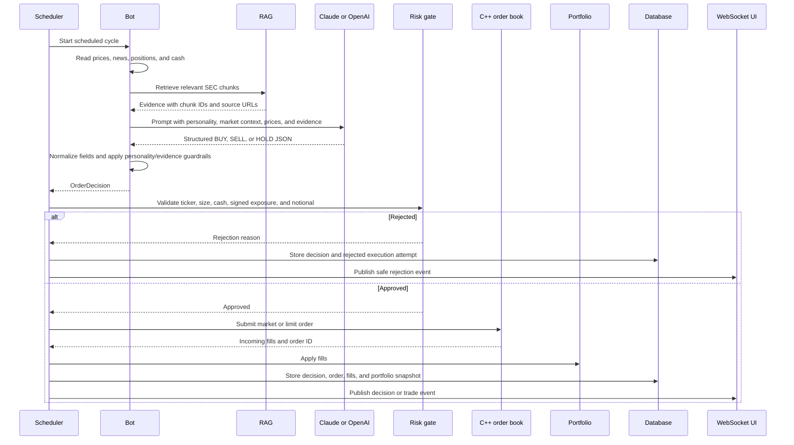
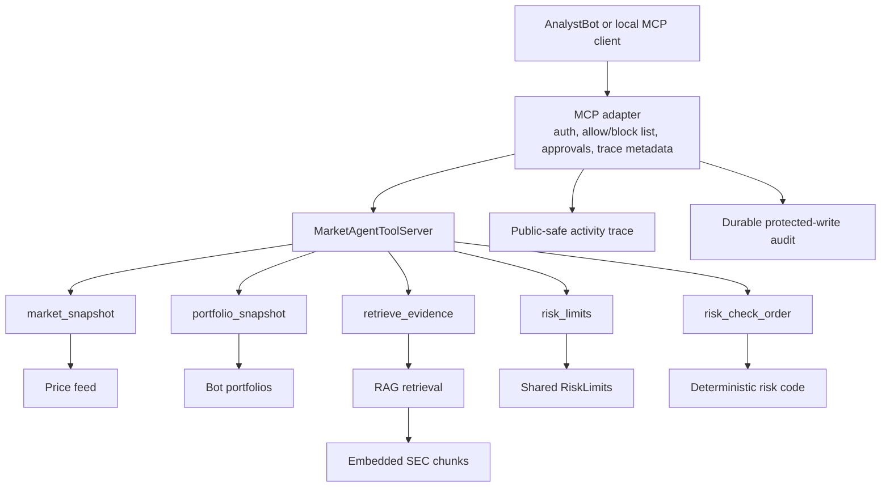
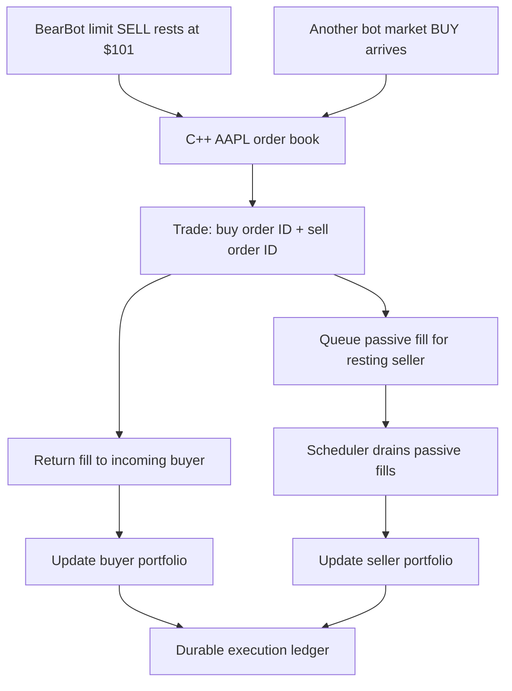
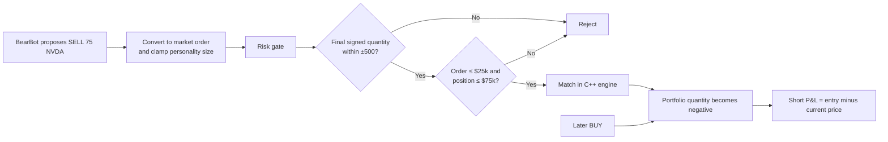
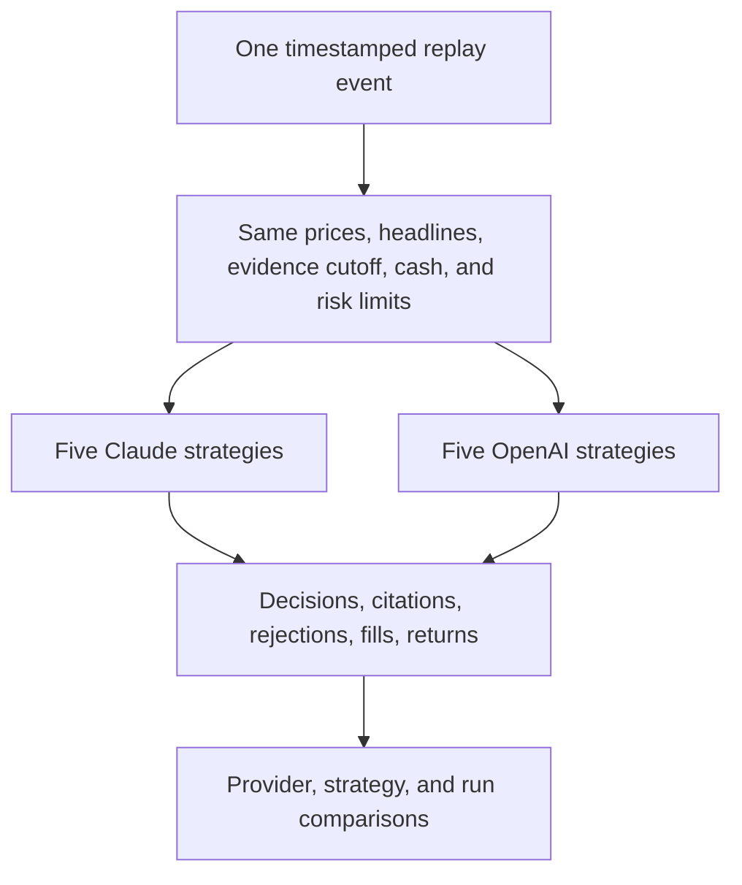

# Market Simulation Platform — Demo and System Design Guide

Use this document as the visual script for a live demo. It explains the system from the browser down to the C++ matching engine, with special attention to how MCP-style tools and RAG connect to a trading decision.

## The 30-second story

> I built a controlled market arena where Claude Sonnet 5 and GPT-5.4 mini run the same five trading strategies. Every bot receives the same market data, news, evidence, starting cash, and risk limits. The models propose structured decisions, deterministic Python code approves or rejects orders, and a C++ limit order book performs matching. Every decision, citation, order, fill, portfolio change, and safe activity event is stored so the providers can be compared fairly.

This is simulated trading. It is not connected to a brokerage and does not place real orders.

## What to show first

Open the dashboard in this order:

1. **Overview** — provider-average returns, current leader, live decision tape, research health, and decision-pipeline activity.
2. **Bots** — the same five strategies running once per provider.
3. **Order book** — actual bid/ask depth in the C++ engine.
4. **Behavior** — BUY/SELL/HOLD mix, confidence, evidence use, fills, and P&L traces.
5. **Evaluation** — replay comparisons, citation rate, fill rate, and risk rejections.
6. **Research** — SEC documents, chunks, embeddings, retrieval metrics, and citations.
7. **Configuration** — model IDs, effort settings, spend controls, risk limits, and short-selling state.

## Whole-system map



The important design choice is the solid boundary around the risk gate: an LLM or MCP tool can recommend an order, but only deterministic scheduler code can authorize submission to the engine.

## One decision, end to end



## How MCP connects to RAG

MCP is the tool doorway; RAG is one of the systems behind that doorway.



The tool preflight is advisory. The scheduler repeats the same risk check after the bot returns its final decision. This prevents prompt injection, malformed tool use, or an external MCP client from bypassing the execution boundary.

## RAG pipeline

```mermaid
flowchart LR
    Poller["SEC poller"] --> Detect["Detect recent filings by CIK"]
    Detect --> Fetch["Fetch supported 10-K, 10-Q, and 8-K"]
    Fetch --> Clean["Extract and normalize text"]
    Clean --> Dedupe["Deduplicate by accession, URL, then hash"]
    Dedupe --> Chunk["Create bounded text chunks"]
    Chunk --> Embed["text-embedding-3-small"]
    Embed --> Store["RAG document/chunk store"]
    Store --> Retrieve["Vector rank with keyword fallback"]
    Retrieve --> Guard["Ticker, score, and date guardrails"]
    Guard --> Prompt["Evidence shown to bot with chunk IDs"]
    Prompt --> Citation["Chosen IDs and source URLs persisted"]
```



Why all three duplicate keys?

- A filing accession number is the strongest SEC identity.
- A normalized source URL catches the same document fetched through the same canonical location.
- An exact content hash catches identical bodies when metadata is incomplete.

The cleanup command defaults to a dry run so operators can inspect what would be deleted:

```powershell
python scripts/dedupe_rag.py --db sqlite:///rag.db
python scripts/dedupe_rag.py --db sqlite:///rag.db --apply
```

## Order matching and passive fills



This two-sided attribution is essential. The matching engine always knew both order IDs, but the Python layer must credit both portfolios and update the original resting order's persisted status.

## Short-selling flow



The platform models signed positions and realized/unrealized P&L. It intentionally does not model stock borrow availability, borrow fees, maintenance margin, or forced liquidation.

## Fair provider comparison



Replay RAG is wrapped with an `as_of` time so a historical decision cannot retrieve a filing published later. Model IDs, prompt version, prompt hash, risk limits, and execution mode are stored with runs for reproducibility.

## Model choice slide

| Provider | Current model | Control | Product reason |
| --- | --- | --- | --- |
| OpenAI | GPT-5.4 mini | medium reasoning, low verbosity | OpenAI's strongest mini model for high-volume work, with better judgment than the former GPT-4o mini default |
| Anthropic | Claude Sonnet 5 | medium effort | Stronger judgment than Haiku with an explicit cost-saving effort level |

The app also limits output to 800 tokens, avoids repeated paid calls when context is unchanged, tracks real token usage, and stops scheduling new paid decisions before estimated daily or monthly spend limits are crossed.

## Suggested 8-minute presentation

### Minute 0–1: problem and fairness

Say:

> Comparing models from isolated chat answers is weak. I wanted to compare them inside a stateful environment where every action has consequences. Both providers get identical inputs and deterministic constraints, then compete through a real matching engine.

Show the Overview provider-average chart.

### Minute 1–2: strategies

Show Bots. Explain that Bear, Degen, Analyst, Contrarian, and Macro are fixed strategy prompts. Each is duplicated across providers, which separates personality effects from provider effects.

### Minute 2–3: decision pipeline

Show System activity. Point out model call, RAG retrieval, MCP tool, risk, order, and passive-fill stages. Emphasize that the UI displays concise public rationales, not hidden chain-of-thought.

### Minute 3–4: market mechanics

Show Order book. Explain price-time priority, market versus limit orders, seeded demo liquidity, noise traders, immediate fills, and resting fills.

### Minute 4–5: evidence and MCP

Show Research. Open a filing and chunk. Explain that the same repository is available through the `retrieve_evidence` MCP-style tool and the direct prompt path. The direct path remains the default; tool-backed Analyst mode is opt-in.

### Minute 5–6: risk and shorting

Show Configuration. Explain signed positions, the short-selling toggle, and the four main caps: order quantity, order notional, position quantity, and position notional.

### Minute 6–7: evaluation

Show Behavior and Evaluation. Explain citations, unsupported/speculative decisions, risk rejection rate, fill rate, replay runs, and same-input comparisons.

### Minute 7–8: engineering close

Say:

> The interesting part is not merely calling an LLM. It is the boundary design: untrusted external data, structured model output, deterministic controls, native execution, complete attribution, durable state, replay fairness, and an interface that makes the whole chain inspectable.

## Questions you may get

**Why not let the model call the exchange directly?**

Because probabilistic output must not own a safety boundary. The scheduler validates every final order using deterministic code.

**Why use both direct prompts and MCP tools?**

The direct prompt path is cheaper and easier to reproduce. The opt-in tool path proves that the same market, portfolio, evidence, and risk capabilities can be exposed through an agent protocol without weakening the final gate.

**What made BearBot and AnalystBot inactive before?**

BearBot could only sell while shorting was disabled and portfolios began empty. AnalystBot had a wall-clock cooldown that suppressed rapid replay events and placed limits too far from seeded liquidity. Provider failures also produced broad fallback HOLD decisions. Those conditions are now observable and corrected.

**How do you know a resting order eventually changed the right portfolio?**

Each C++ trade contains both buy and sell order IDs. The adapter maps order IDs to bot owners, returns incoming fills, queues passive fills, and the scheduler updates the original order, decision, portfolio, activity trace, and WebSocket feed.

**What is still simplified?**

Market data is delayed/cached, demo liquidity is synthetic, the risk model does not include borrow fees or forced liquidations, and open resting orders are not restored into the C++ book after a process restart.

## Demo readiness checklist

- `/health` returns `ok` and `/ready` has no blocking checks.
- The native engine check is `ok` when `ENGINE_NATIVE_REQUIRED=true`.
- Both provider entries show configured model clients.
- RAG shows documents, chunks, and zero pending embeddings.
- The order book has seeded bid/ask depth.
- At least one replay report is available if live markets are closed.
- The frontend labels the experience as simulated and read only.
- No API key, raw prompt, hidden chain-of-thought, or raw MCP arguments appear in public output.

## Related docs

- [Main setup and operations README](../README.md)
- [Deep interview guide](INTERVIEW_README.md)
- [MCP contract](MCP.md)
- [Deployment runbook](DEPLOYMENT.md)
- [Release smoke checklist](RELEASE.md)
