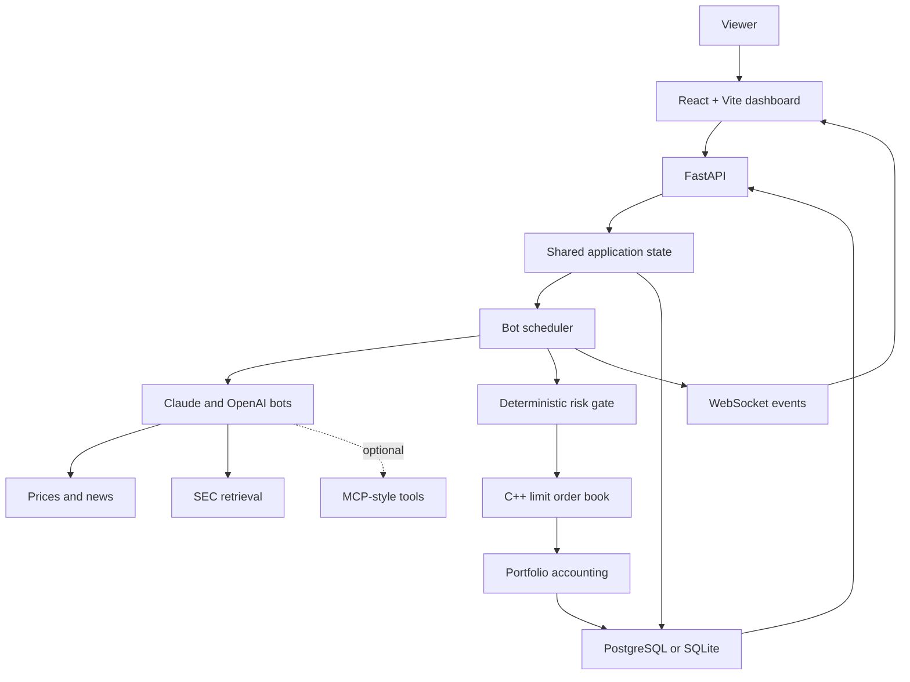
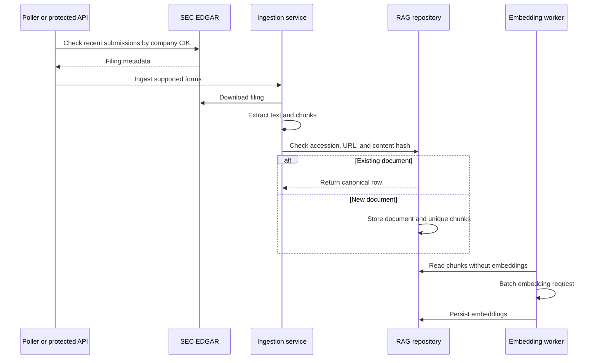
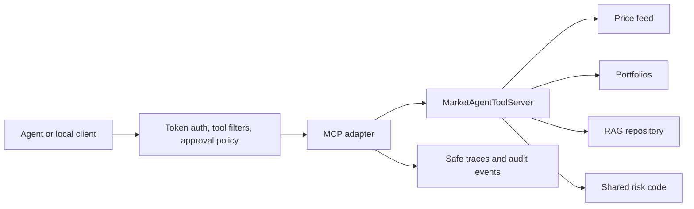
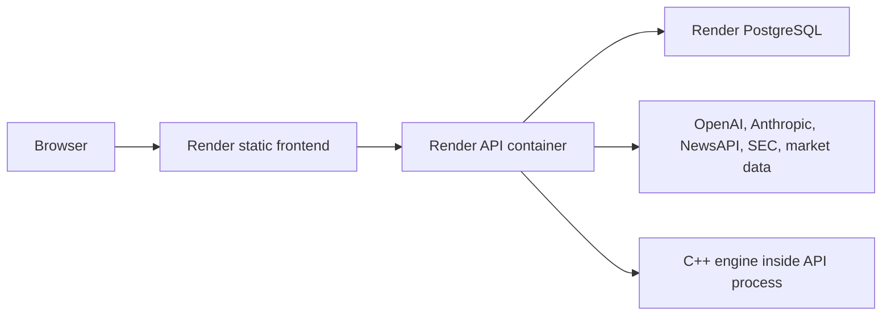

# Market Simulation Platform — Explain It Like I'm 12 and Interview Guide

This guide starts with a simple story, then gradually adds the real engineering details. Read the first three sections for a simple explanation. Read the whole document to prepare for architecture, backend, AI, data, trading, frontend, testing, and deployment questions.

## The simplest possible explanation

Imagine a school trading game:

- Ten robot players receive the same pretend money.
- They read prices, news, and company reports.
- Each robot chooses **buy**, **sell**, or **do nothing**.
- A strict referee checks every choice.
- An auction machine matches buyers with sellers.
- A scorekeeper updates everyone's cash, investments, and profit.
- A website lets people watch what happened and compare the teams.

Five robots use Claude Sonnet 5 and five use GPT-5.4 mini. The two teams have matching personalities, so the comparison is fair.

Nothing connects to a real broker. No real money moves.

## The pizza-market analogy

Suppose students trade pizza coupons.

- Alice says, “I will buy one coupon for at most $9.” That is a **limit buy**.
- Ben says, “I will sell one for at least $11.” That is a **limit sell**.
- Their prices do not overlap, so both offers wait in the order book.
- Cara says, “Buy one now at the best available price.” That is a **market buy**.
- Cara matches Ben's $11 offer.
- The book records a trade, Cara gets the coupon, and Ben gets the cash.

This project does the same thing with simulated shares. The C++ engine is the auction machine. Python is the referee and tournament organizer. PostgreSQL is the notebook. FastAPI is the service counter. React is the scoreboard.

## The one-sentence technical version

Market Simulation Platform is a multi-provider LLM evaluation environment where structured trading decisions pass through deterministic risk controls into a C++ price-time-priority limit order book, with durable decision/fill/RAG/replay telemetry exposed through FastAPI and a read-only React dashboard.

## Why this project exists

The project demonstrates several engineering skills in one coherent product:

1. **Market mechanics** — orders, liquidity, matching, fills, positions, shorts, and P&L.
2. **AI product engineering** — prompts, structured output, model failures, evidence, agents, and cost controls.
3. **Systems design** — a native engine behind Python orchestration and a web API.
4. **Data engineering** — SEC ingestion, document chunking, embeddings, retrieval, deduplication, and jobs.
5. **Evaluation** — fair replays, no-lookahead evidence, model metadata, and comparison metrics.
6. **Product design** — a public-safe dashboard that explains the system without exposing secrets or hidden reasoning.
7. **Operations and security** — health checks, protected writes, audit logs, migrations, containers, CI, and deployment configuration.

## The system at a glance



## Repository tour

### `engine/`

The native C++17 matching engine. It owns order-book mechanics:

- bid and ask books;
- price-time priority;
- limit and market orders;
- partial and complete fills;
- cancellations;
- trade history;
- top-of-book and depth snapshots;
- Python bindings through pybind11;
- native tests and a benchmark.

Why C++? Matching is stateful, performance-sensitive, and a good fit for deterministic data structures. It also demonstrates a real native/Python boundary rather than simulating everything in application code.

### `simulator/`

The tournament brain:

- bot base class and five personalities;
- model clients and structured-output parsing;
- price and news feeds;
- scheduler and market-hours logic;
- deterministic risk checks;
- engine adapter;
- portfolio accounting;
- decision, order, fill, and activity persistence;
- RAG ingestion/retrieval;
- MCP-style tools;
- evaluation and replay.

### `api/`

The FastAPI application:

- constructs shared services at startup;
- initializes bots and restores portfolios;
- exposes public reads and protected writes;
- broadcasts live events through WebSockets;
- reports readiness and degraded dependencies;
- exposes evaluation, replay, RAG, operations, MCP, and audit routes.

### `frontend/`

The React/Vite/Tailwind dashboard:

- Overview;
- Bots;
- Order book;
- Behavior analytics;
- Evaluation/replays;
- Research/RAG;
- Configuration.

Routes are code-split so large chart/report screens are loaded only when opened.

### `scripts/`

Operational and evaluation commands:

- SEC polling and ingestion;
- embedding worker;
- duplicate cleanup;
- retrieval benchmark and suite runner;
- replay and replay matrix;
- RAG job inspection/requeue;
- MCP server and client example;
- container and release checks.

## The ten competitors

Each strategy runs once on Claude and once on OpenAI.

| Strategy | Behavior | Order style | Evidence policy |
| --- | --- | --- | --- |
| BearBot | Finds downside risk; SELL or HOLD | Market SELL for executable bearish ideas | Evidence is helpful but not mandatory |
| DegenBot | Aggressive headline/momentum strategy | Market orders | May be explicitly speculative |
| AnalystBot | Methodical, filing-supported strategy | Marketable limit orders | Strong dated evidence for the selected ticker is required |
| ContrarianBot | Fades moves larger than its threshold | Limit orders | Evidence is helpful but not mandatory |
| MacroBot | Trades rates, inflation, yields, geopolitics, and macro ETFs | Limit orders | Does not require SEC evidence because its ETF universe has no issuer filing equivalent |

Why duplicate personalities across providers? If Claude ran Bear and OpenAI ran Analyst, provider and strategy effects would be mixed together. Mirroring all five personalities makes provider-level comparison more meaningful.

## Why the model defaults changed

The old defaults were GPT-4o mini and Claude Haiku. They were fast and inexpensive, but this application needs judgment across news, evidence, exposure, price, confidence, and order construction.

The current defaults are:

- `gpt-5.4-mini` with medium reasoning and low verbosity;
- `claude-sonnet-5` with medium effort.

This is a middle tier: stronger than the cheapest mini/Haiku choices, less expensive than using the largest model for every hourly decision.

The project controls cost in six ways:

1. Prompts include only bounded numbers of headlines, tickers, and evidence chunks.
2. Evidence excerpts are bounded rather than sending entire filings.
3. Output is capped at 800 tokens.
4. Identical prompts can reuse or skip paid decisions.
5. Real token usage is converted into provider-specific estimated cost.
6. Daily/monthly call and dollar guards stop new paid cycles before the configured budget is crossed.

Model failures return HOLD. A failure never becomes an order. This includes DegenBot: its “never hold” personality applies to a valid model decision, not to an API outage or invalid JSON.

## What goes into a model prompt

Every bot receives a controlled packet:

- its fixed personality and order-style rules;
- untrusted-data warning against prompt injection;
- trending headlines;
- recent headlines;
- ticker-specific headlines;
- the allowed ticker universe;
- current reference prices;
- current cash;
- signed positions;
- up to a bounded number of retrieved evidence chunks;
- explicit decision rules;
- a JSON output schema.

The model is asked for one concise public rationale, not hidden chain-of-thought.

The required output contains:

```json
{
  "action": "BUY",
  "ticker": "AAPL",
  "quantity": 25,
  "limit_price": 190.5,
  "reasoning": "Revenue growth and margin evidence support a modest long position.",
  "headline_used": "Apple reports quarterly results",
  "confidence": 0.72,
  "evidence_ids": [123],
  "research_tickers": [],
  "speculative": false
}
```

The application then normalizes and validates the payload. It does not trust casing, stringified numbers, missing fields, unknown tickers, out-of-range confidence, or invented evidence IDs.

## Decision guardrails versus risk controls

These are related but different.

### Bot guardrails

Bot guardrails preserve strategy semantics:

- BearBot can never BUY.
- DegenBot uses market orders and bounded aggressive size.
- AnalystBot uses a marketable limit and requires same-ticker, dated evidence.
- ContrarianBot gets concrete intraday-move context.
- MacroBot can only trade SPY, QQQ, TLT, GLD, and IEF.

### Final risk gate

The scheduler runs deterministic checks for every non-HOLD decision:

- action must be BUY or SELL;
- ticker must be tradable;
- quantity must be a positive integer;
- order quantity must be within the cap;
- reference price must be valid;
- order notional must be within the cap;
- a BUY must leave enough cash;
- final signed position quantity must be within the cap;
- final absolute position notional must be within the cap;
- a short is allowed only when the shared toggle permits it.

The default limits are intentionally simple and visible through the API. The same `RiskLimits` instance is shared by the scheduler and agent tools so preflight and final enforcement use one contract.

## Short selling, from zero to cover

Suppose BearBot starts with $100,000 and no AAPL.

1. It sells 100 AAPL at $100.
2. Cash becomes $110,000.
3. Position becomes `-100` shares.
4. Cost basis is $100, the short entry price.
5. If AAPL falls to $90, unrealized P&L is `(90 - 100) × -100 = +$1,000`.
6. If the bot buys 40 shares at $90, it covers part of the short and realizes `$400`.
7. Position becomes `-60`.

If a BUY is large enough to cross through zero, the short is closed and the remaining shares become a new long position with the fill price as the new basis. The reverse works when a SELL closes a long and continues into a short.

What is not modeled:

- borrow availability;
- borrow fees;
- locate rules;
- maintenance margin;
- forced liquidation;
- dividends owed by short sellers.

That boundary is deliberate: this is a competitive simulation, not a prime-broker risk system.

## How the matching engine works

The order book has two sides:

- bids: buyers, highest price first;
- asks: sellers, lowest price first.

Within the same price, the earlier order wins. That is price-time priority.

### Limit order

A limit order specifies its worst acceptable price:

- BUY limit: pay no more than this price;
- SELL limit: receive no less than this price.

If it cannot match immediately, it rests in the book.

### Market order

A market order asks to execute immediately against the best available opposite-side liquidity. It does not set a resting price.

### Partial fill

If a 100-share BUY meets only 40 shares of sell liquidity, 40 shares fill. A limit order may keep the remaining 60 in the book; a market order does not become a resting limit order.

## Why passive-fill attribution matters

An incoming order is easy to update because the submit call immediately returns its fills. A resting order is harder:

1. AnalystBot submits a BUY limit and receives zero immediate fills.
2. The order waits.
3. A later seller matches it.
4. The C++ trade contains both the buyer order ID and seller order ID.
5. The adapter returns the seller's incoming fill and queues the buyer's passive fill.
6. The scheduler drains the queue.
7. AnalystBot's cash, position, original execution order, original decision, activity trace, and UI event are updated.

Without this step, the engine and portfolio database disagree. A leaderboard could show no trade even though the book executed one. This was one of the most important end-to-end fixes.

## Liquidity and noise traders

A matching engine needs counterparties. The application supplies two kinds of demo liquidity:

- **Seeded depth** places several bid and ask levels around the current reference price at startup.
- **Noise traders** periodically place and sometimes cancel small random limit orders.

They are infrastructure, not leaderboard competitors. Their IDs are excluded from portfolio settlement and public bot results.

The standalone simulator and FastAPI startup paths both seed liquidity. Executable replays seed isolated liquidity from replay-event prices.

## RAG, explained simply

LLMs know general information, but they should not pretend to know a filing that was not in the prompt. RAG means:

1. fetch source documents;
2. split them into smaller chunks;
3. turn each chunk into a numeric embedding;
4. compare a question embedding with chunk embeddings;
5. send the most relevant chunks to the model;
6. store which chunks the model cited.

The project uses SEC filings because they are authoritative, dateable, and useful for replay fairness.

## SEC ingestion pipeline



Supported demo forms are 10-K, 10-Q, and 8-K. The repository retains provenance including ticker, CIK, accession number, filing date, form, source URL, and text offsets.

## Duplicate prevention and cleanup

Duplicate bodies are not always byte-identical. SEC HTML can be re-rendered while the filing identity stays the same. The repository therefore checks, in order:

1. accession number;
2. normalized source URL;
3. exact content hash.

Chunks within one ingestion are also deduplicated by content and offsets.

The cleanup command builds groups connected by any stable key, keeps the lowest document ID as canonical, and removes duplicate documents plus their cascaded chunks only when `--apply` is passed.

The stores audited during this work contained no duplicate groups. Deployment startup seeding is now disabled: the production library keeps its existing filings, while four explicitly reset tickers can be ingested again only when future bot/news research requests them. A durable maintenance marker makes that reset run only once.

## Retrieval and evidence guardrails

The retriever tries vector similarity first. If embeddings are unavailable, it falls back to deterministic keyword scoring.

Evidence guardrails check:

- the chunk really came from the retrieved result set;
- its score meets the configured threshold when evidence is required;
- the filing has a date;
- the evidence ticker matches the selected AnalystBot ticker;
- future-dated documents are excluded during replay.

Why is AnalystBot the only default evidence-required strategy? It is explicitly the filing-driven strategy. Requiring SEC evidence from MacroBot was incorrect because macro ETFs do not publish company 10-Q or 10-K filings in the same sense. Requiring filing evidence for every strategy also caused valid news/momentum strategies to hold indefinitely.

## What MCP means here

MCP is a standard pattern for exposing tools to models or agent clients. In this project, the MCP-style adapter makes a small set of typed capabilities available:

- `market_snapshot`;
- `portfolio_snapshot`;
- `retrieve_evidence`;
- `risk_limits`;
- `risk_check_order`.

The tool server calls ordinary application services. It does not create a second trading system.



The direct prompt path stays the default because it is cheaper and easier to reproduce. AnalystBot's tool-backed path is opt-in. Even there, the scheduler remains the final execution authority.

## Scheduler responsibilities

The scheduler is the hard gate and orchestration layer. One cycle does this:

1. confirm market-hours policy;
2. confirm model call/spend budget;
3. ask a bot to decide;
4. queue requested research for future coverage;
5. persist HOLD immediately, or continue;
6. normalize stale limits and auto-size the order;
7. run deterministic risk;
8. submit approved orders through the only engine adapter;
9. apply incoming fills;
10. persist decision, execution order, and fill rows;
11. settle passive fills for older resting orders;
12. emit safe activity and WebSocket events;
13. catch exceptions so one bot cannot kill the tournament.

Bot schedules are staggered to avoid sending a burst of ten simultaneous provider requests.

## Persistence model

The important tables are conceptually:

| Table/group | Purpose |
| --- | --- |
| `bot_decisions` | Model action, rationale, evidence, usage, cost, fill summary, and portfolio snapshot |
| `execution_orders` | Every non-HOLD order attempt, including rejection and error states |
| `execution_fills` | Exact individual fills used to restore portfolios |
| `agent_activity_events` | Safe model/tool/risk/execution breadcrumbs |
| `rag_documents` | Filing identity, provenance, and normalized content |
| `rag_chunks` | Bounded source chunks and embeddings |
| `rag_job_status` | Ingestion/embedding attempts, errors, retries, and metadata |
| replay tables | Run config, input fingerprint, decisions, risk, fills, and snapshots |
| retrieval history | Benchmark outcomes over time |
| audit events | Protected writes and safe MCP operation metadata |

Why store both decisions and execution orders? A model decision and an execution outcome are different facts. A BUY can be rejected, error before submission, rest open, fill partially, or fill later. Separating them preserves that history.

## Restart behavior

The C++ book is in memory, while the database survives restarts.

At API startup:

- bots are rebuilt;
- exact persisted fill rows are replayed into each portfolio;
- older databases can fall back to filled-decision summaries;
- signed positions and P&L state are reconstructed.

Open resting orders are recorded but are not reinserted into the new in-memory C++ order book. That is a known boundary. A production exchange simulator would persist and rebuild full book state or use an event-sourced matching service.

## Historical replay and fairness

A replay event contains a timestamp plus prices and optional headlines. The runner:

1. applies the event's prices/news to replay-only feeds;
2. sets an evidence `as_of` timestamp;
3. asks each selected bot to decide;
4. runs the same deterministic risk code;
5. optionally executes against an isolated seeded order book;
6. reconciles incoming and passive fills;
7. persists result and model configuration.

The input events are hashed. Runs with the same fingerprint can be compared, which helps ensure the providers saw identical scenarios.

No-lookahead RAG is critical. A model deciding on January 1 must not retrieve a filing published January 20.

## Evaluation metrics

The project measures more than P&L:

- action distribution: how often each bot buys, sells, or holds;
- confidence distribution;
- citation rate;
- evidence-backed versus unsupported/speculative decisions;
- risk rejection rate;
- fill rate;
- portfolio-value trace;
- per-provider and per-strategy behavior;
- retrieval Recall@K and mean reciprocal rank;
- replay comparison across identical inputs.

P&L alone is noisy. A model can get lucky. Behavior, evidence quality, risk, and reproducibility make the evaluation more informative.

## API design

FastAPI exposes three broad surfaces:

### Public reads

Bots, leaderboard, order books, recent decisions/trades, behavior, evaluation, RAG catalog/status, safe config, health, readiness, and WebSocket events.

### Protected writes

Replay creation, ingestion runs, embedding runs, RAG job requeue, and sandbox controls require the arena API key and produce audit events.

### Local MCP bridge

The HTTP MCP-style bridge uses a separate bearer token, tool allow/block lists, approval metadata, safe trace fields, and audit logging. It is documented as local-only until a real external client requires full remote MCP protocol compatibility.

## Health versus readiness

- `/health` answers whether the web process is alive.
- `/ready` checks whether application state is initialized and reports engine, database, scheduler, RAG, public mode, and provider-client state.

Some checks may be degraded without blocking the process. For example, local offline development may intentionally run without the native engine or live scheduler. Production can set `ENGINE_NATIVE_REQUIRED=true` so a missing native engine becomes blocking.

## Frontend information architecture

The redesign follows a simple hierarchy:

1. What is happening? — provider performance and current leader.
2. Why did it happen? — live decisions and public rationales.
3. Was it safe? — risk and execution activity.
4. What evidence existed? — RAG status and research library.
5. Can I inspect details? — strategy, behavior, replay, and config routes.

The visual language is neutral rather than “AI themed”:

- flat neutral canvas;
- white work surfaces;
- restrained radius and shadow;
- provider color only where comparison needs it;
- green/red reserved for financial/status meaning;
- normal sentence case instead of excessive labels;
- tabular numerals for financial values;
- visible keyboard focus;
- mobile-first spacing and horizontally safe dense tables.

## WebSocket behavior

The scheduler runs outside the async request loop. Its event callback safely hands events to the FastAPI loop, which broadcasts them to connected dashboards.

Events are compact and public-safe. The client also polls recent stored decisions so refreshing the page does not produce an empty feed while waiting for the next socket event.

## Security model

Important controls include:

- secrets live in environment variables, not source;
- public mode removes operator-only configuration details;
- write endpoints require authentication;
- MCP tools can be allowed, blocked, and approval-gated;
- audit records omit secrets, raw tool arguments, and tool outputs;
- model prompts label headlines/evidence as untrusted data;
- model output is parsed and normalized as untrusted input;
- only the scheduler submits orders;
- CORS, body size, rate limit, and security-header controls exist for public deployment;
- hidden chain-of-thought is not stored or displayed.

The project does not claim production identity, broker compliance, or financial-grade risk management.

## Failure behavior

| Failure | Behavior |
| --- | --- |
| Missing provider key | That provider's bot returns HOLD; readiness reports degraded provider config |
| Model timeout/error/quota | Safe categorized HOLD; no raw provider error is exposed as public reasoning |
| Invalid JSON or unknown ticker | Normalize or force HOLD |
| Missing strong Analyst evidence | Force HOLD |
| Risk violation | Persist rejected order; never call engine |
| Native engine submit error | Persist execution error; circuit breaker can suspend the ticker |
| Database decision write failure | Log error and write a local JSONL fallback |
| Embedding unavailable | Keyword retrieval fallback remains available |
| News unavailable | Empty headline lists; strategies may HOLD |
| One bot crashes | Scheduler logs it and continues other bots |

## Circuit breaker

If repeated engine submissions fail for one ticker, the adapter temporarily suspends that ticker. This prevents a tight error loop from repeatedly hammering a broken book while leaving other tickers available.

## Technology choices and reasoning

### C++17

Used for deterministic order matching and market-structure performance. It demonstrates native data structures and a stable boundary.

### pybind11

Exposes the C++ engine directly to Python without building a separate network service for the local/demo scope.

### Python

Used for model SDKs, orchestration, data ingestion, evaluation, and the web backend. It has strong AI/data tooling and keeps policy code easy to test.

### FastAPI

Provides typed routes, async WebSockets, automatic OpenAPI docs, dependency-based auth, and a clean application lifespan.

### SQLAlchemy and Alembic

SQLAlchemy supports PostgreSQL and SQLite. Alembic handles schema migration for durable deployment rather than relying only on `create_all`.

### PostgreSQL

The deployment database for decisions, exact fills, RAG, replay, operations, and audit history.

### React, Vite, and Tailwind

React provides component/state structure, Vite gives fast builds and code splitting, and Tailwind keeps the design system close to components.

### Recharts

Used for accessible dashboard charts without writing a bespoke charting engine.

### Docker and Render

Multi-stage images keep compilers out of the API runtime image. The Render Blueprint defines API, static frontend, and PostgreSQL resources with environment wiring.

## Testing strategy

The Python suite covers:

- bot personality constraints;
- structured model payloads and cost controls;
- risk checks and short limits;
- long/short portfolio accounting;
- engine adapter behavior;
- incoming and passive fill attribution;
- durable decision/order/fill/activity logs;
- RAG storage, dedupe, retrieval, jobs, and evidence guardrails;
- agent tools and MCP policy;
- replay, no-lookahead behavior, and evaluation;
- FastAPI endpoints, auth, public mode, ops, and audit behavior.

Current verified result:

```text
179 passed, 1 skipped
```

The optional skip occurs when the native C++ Python extension is not built in the test environment. The frontend production build is also verified with `npm run build`.

## How to run it locally

From the repository root:

```powershell
python -m venv .venv
.\.venv\Scripts\Activate.ps1
pip install -r requirements.txt
cmake -S engine -B engine/build
cmake --build engine/build --config Debug
pytest -q
python -m uvicorn api.server:app --host 0.0.0.0 --port 8000 --reload
```

In another terminal:

```powershell
cd frontend
npm install
npm run dev
```

Use `.env.example` as the configuration template. Never commit real keys.

## Important environment variables

| Variable | Meaning |
| --- | --- |
| `DATABASE_URL` | Main SQLAlchemy database |
| `OPENAI_API_KEY` | OpenAI decisions and optional embeddings |
| `OPENAI_PROJECT_ID` | Optional OpenAI project scope |
| `ANTHROPIC_API_KEY` | Claude decisions |
| `NEWS_API_KEY` | Live headlines |
| `SEC_USER_AGENT` | Required SEC request identity/contact |
| `OPENAI_MODEL` | Default `gpt-5.4-mini` |
| `CLAUDE_MODEL` | Default `claude-sonnet-5` |
| `OPENAI_REASONING_EFFORT` | Default `medium` |
| `CLAUDE_EFFORT` | Default `medium` |
| `LLM_MAX_TOKENS` | Output cap, default 800 |
| `LLM_MONTHLY_SPEND_LIMIT_USD` | Estimated internal monthly cap |
| `SHORT_SELLING_ENABLED` | Enables bounded signed short positions |
| `RAG_EVIDENCE_REQUIRED_BOTS` | Defaults to AnalystBot |
| `ANALYST_AGENT_TOOLS_ENABLED` | Opt-in Analyst MCP/tool path |
| `PUBLIC_READ_ONLY_MODE` | Hides operator functionality from public reads |
| `ARENA_API_KEY` | Protects write endpoints |
| `AGENT_MCP_HTTP_TOKEN` | Protects local HTTP MCP bridge |
| `ENGINE_NATIVE_REQUIRED` | Makes missing C++ binding a readiness/startup failure |

## Deployment shape



The free hosting shape can sleep. That means it is suitable for a recruiter/demo deployment, not a claim of uninterrupted autonomous trading. Always-on simulation should move scheduling into a dedicated worker with production monitoring and backups.

## What I would build next for production

1. Persist and restore the full open order book, not only portfolios and fills.
2. Move scheduler/research workers out of the API process.
3. Add real identity and role-based authorization.
4. Add provider-side spend alerts plus operational alerting.
5. Add database backups and restore drills.
6. Use larger, manually audited retrieval/replay datasets.
7. Add stock-borrow, fees, margin, liquidation, and corporate actions if short realism is required.
8. Add deterministic slippage/latency models and richer liquidity regimes.
9. Run longer statistical comparisons with confidence intervals rather than judging small samples.
10. Upgrade the local HTTP tool bridge to a fully remote MCP deployment only when a real client requires it.

## Common interview questions and strong answers

### “What was the hardest bug?”

The most important systemic bug was passive-fill attribution. The engine produced correct trades, but Python only credited the incoming order. A previously resting bot could execute without its portfolio or ledger changing. I fixed it by tracking order ownership in the adapter, attributing both order IDs from every native trade, queueing the passive side, and updating the original durable order and decision when the scheduler drains the fill.

### “Why were BearBot and AnalystBot not trading?”

There were several independent causes:

- BearBot was sell-only, shorting was disabled, and every portfolio began with zero inventory.
- AnalystBot used a real-time one-hour cooldown, which is wrong for fast historical replay.
- Analyst limits were placed away from current price and often did not cross seeded liquidity.
- evidence policy was applied too broadly;
- active historical decisions showed provider-failure fallback HOLDs across all bots.

The fix required addressing strategy, risk, execution, evidence, observability, and deployment configuration rather than changing one prompt.

### “Why not use only market orders?”

Market orders improve execution certainty but remove price control. Different strategies should express different execution behavior. Bear and Degen use market orders when their personality prioritizes action. Analyst uses a marketable limit to cap price while still reaching seeded liquidity. Other limit strategies can rest and receive later fills, which the platform now reconciles correctly.

### “How do you stop hallucinated citations?”

The model may return only chunk IDs from the retrieved set. The application intersects returned IDs with actual retrieved IDs, enforces score/date/ticker rules for evidence-required trades, and derives source URLs from repository records rather than trusting model-supplied URLs.

### “How do you prevent prompt injection from filings or news?”

The prompt explicitly labels all market/evidence text as untrusted data and tells the model to ignore embedded instructions. More importantly, the model cannot perform arbitrary actions: output is parsed into a small schema, ticker/evidence/personality guardrails run in code, and the scheduler's deterministic risk gate owns engine access.

### “How is the model comparison fair?”

Both providers run all five personalities with the same price/news/evidence inputs, starting cash, risk limits, market-hours rules, and execution engine. Replay events have an input fingerprint, evidence has an as-of cutoff, and run metadata stores model/prompt/risk configuration.

### “Why is the direct prompt path still the default?”

It is cheaper, lower-latency, and easier to reproduce. Tools are valuable when the model needs iterative information gathering, but they increase state and failure modes. The optional Analyst tool path demonstrates MCP integration without making the whole product depend on it.

### “Why C++ inside the API process instead of a service?”

For local/demo scale, pybind11 removes network complexity and keeps matching fast. At production scale, a separate stateful matching service or event-sourced engine would improve independent scaling, restart recovery, and operational isolation.

### “What does ‘no gaps’ mean in practice?”

It means checking the complete state transition, not only whether a function returns:

```text
data exists → prompt is valid → model is reachable → output is parsed →
strategy guardrail preserves intent → risk approves → liquidity exists →
engine matches → both portfolios update → durable rows agree → API exposes it →
UI explains it → replay and restart reproduce it
```

That checklist uncovered problems that unit-testing only the model prompt would miss.

### “What would you measure before claiming one model is better?”

I would use a larger preregistered replay suite, enough independent market scenarios, identical budgets, confidence intervals for return/fill/citation/risk metrics, and manual review of evidence quality. A small live demo is illustrative, not statistically decisive.

## A polished two-minute answer

> I built a market simulation platform to evaluate LLM agents in a stateful environment instead of comparing isolated chat answers. Claude Sonnet 5 and GPT-5.4 mini each run five identical trading personalities. The bots receive bounded prices, news, positions, and SEC evidence, then return structured BUY, SELL, or HOLD decisions. Python applies personality and evidence guardrails, and a deterministic risk layer is the only path into my C++ price-time-priority limit order book. I persist decisions separately from execution orders and exact fills, including fills that happen later against resting orders, so portfolios and replay reports stay consistent. The platform also includes SEC ingestion, embeddings, no-lookahead RAG, an opt-in MCP-style tool layer, cost budgets, protected operations, audit logs, FastAPI/WebSockets, and a read-only React dashboard. The main lesson was that reliable agent systems are mostly about boundaries, attribution, observability, and reproducibility—not just the model call.

## Glossary

| Term | Plain-English meaning |
| --- | --- |
| Ask | A price at which someone offers to sell |
| Bid | A price at which someone offers to buy |
| CIK | SEC identifier for a company |
| Embedding | A numeric representation used to compare semantic similarity |
| Fill | The executed portion of an order |
| Limit order | An order with a maximum buy or minimum sell price |
| Liquidity | Available orders that can trade against new orders |
| Long | Positive share ownership that generally benefits from a price rise |
| Market order | An order to trade immediately at available prices |
| MCP | A protocol/pattern for exposing tools and resources to agents |
| Notional | Price multiplied by quantity |
| Order book | The organized collection of waiting bids and asks |
| Passive fill | A fill received by an order that was already resting in the book |
| P&L | Profit and loss |
| Price-time priority | Better price wins; at equal price, earlier order wins |
| RAG | Retrieving source evidence and adding it to a model's context |
| Replay | Running bots through saved timestamped scenarios |
| Short | A negative position that generally benefits from a price fall |
| Slippage | Difference between expected and actual execution price |
| Spread | Difference between best bid and best ask |
| WebSocket | A persistent connection used to push live events to the browser |

## Related docs

- [Main README](../README.md)
- [Visual demo guide](DEMO_README.md)
- [MCP details](MCP.md)
- [Deployment](DEPLOYMENT.md)
- [Release checklist](RELEASE.md)
