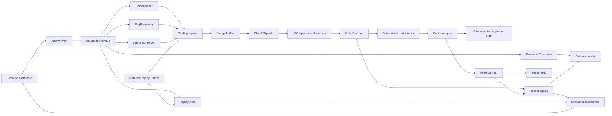

# Architecture And System Design

This document explains the Market Simulation Platform from a system-design
perspective. It is written for two audiences:

1. Future agents continuing implementation.
2. The project owner explaining the architecture in interviews.

## Executive Summary

The platform is an agentic trading simulation and evaluation system.

At a high level:

- AI agents observe market context.
- Agents call LLM providers such as Claude and OpenAI.
- The LLM returns a structured trade proposal.
- The system parses and normalizes the proposal.
- Deterministic risk rules approve or reject it.
- Approved orders may enter a simulated matching engine.
- Portfolio state updates from fills.
- All decisions, orders, fills, evidence, costs, and outcomes are stored.
- Replay runs let us evaluate agents on identical historical/scenario inputs.
- Evaluation modules compare behavior, evidence quality, cost, risk, and PnL.

The core philosophy is:

```text
LLMs propose. Deterministic systems validate, execute, store, and evaluate.
```

This is the most important system-design idea in the project.

## System Diagram



## Major Components

### 1. Frontend Dashboard

Primary files:

- `frontend/src/pages/EvalPage.jsx`
- `frontend/src/pages/RetrievalPage.jsx`
- `frontend/src/components/arena/*`

The frontend is the control room. It does not own trading logic. It asks the API
for current state, leaderboard data, evaluation summaries, replay runs, outcome
labels, RAG status, and agent activity.

Design role:

- Visualize live competition.
- Show agent behavior.
- Show evidence and citation quality.
- Show replay comparisons.
- Export evaluation data.
- Surface scheduler and RAG operational status.

System-design decision:

The UI is intentionally read-heavy. Write operations such as replay creation or
RAG ingestion are protected by API auth. This matters because the app may be
public-facing while still exposing safe observability.

### 2. FastAPI Backend

Primary file:

- `api/server.py`

The backend wires the application together at startup:

- price feed
- news feed
- reasoning log
- replay store
- RAG repository
- embedding service
- engine adapter
- risk limits
- agent tool server
- bot instances
- live bot scheduler
- evaluation scheduler
- audit log
- WebSocket broadcaster

FastAPI also exposes route groups:

- market routes
- leaderboard routes
- evaluation routes
- config routes
- ops routes
- MCP routes
- audit routes
- sandbox routes
- websocket routes

System-design decision:

The backend acts as the composition root. Components are created once and stored
in `api/state.py`, then routers access them through shared app state. This keeps
route functions thin and prevents each endpoint from rebuilding its own
services.

### 3. App State

Primary file:

- `api/state.py`

App state is the runtime dependency container. It holds references to services
that need to be reused by API routes and background jobs.

Examples:

- `bots`
- `engine_adapter`
- `reasoning_log`
- `price_feed`
- `news_feed`
- `scheduler`
- `replay_store`
- `rag_repository`
- `embedding_service`
- `risk_limits`
- `agent_tool_server`
- `evaluation_scheduler`
- `audit_log`

System-design decision:

This is a small, pragmatic dependency container rather than a large framework.
For this project size, that is a reasonable tradeoff: easy to understand, easy
to test, and easy for a future agent to inspect.

### 4. Scheduler

Primary file:

- `simulator/scheduler.py`

The scheduler runs live bot decision cycles.

Responsibilities:

- run each bot on its own timer
- stagger bot starts to avoid simultaneous LLM bursts
- skip bot cycles outside configured market hours
- enforce decision/cost budgets
- ask the bot for a decision
- request research after decisions
- normalize stale limit prices
- autosize orders
- call deterministic risk checks
- submit approved orders to the engine adapter
- apply fills to portfolios
- settle passive fills
- persist decisions and execution records
- emit WebSocket events
- record immediate outcome labels

System-design decision:

The scheduler owns orchestration, not strategy. Bots decide what they want to do;
the scheduler decides when they run and how their decisions move through risk,
execution, logging, and broadcast.

This separation is important because we can replay bot decisions without using
the live scheduler, and we can change scheduling/cost behavior without rewriting
agents.

### 5. Agents

Primary files:

- `simulator/base_bot.py`
- `simulator/bots/analyst_bot.py`
- `simulator/bots/bear_bot.py`
- `simulator/bots/macro_bot.py`
- `simulator/bots/contrarian_bot.py`
- `simulator/bots/degen_bot.py`

The agents are strategy/personality wrappers around a common base class.

The base class owns shared mechanics:

- collect context
- build prompt
- retrieve RAG evidence
- call Claude or OpenAI
- estimate token/cost usage
- parse JSON
- sanitize invalid decisions
- normalize research tickers
- apply tradable universe guardrails
- apply evidence guardrails
- return an `OrderDecision`

Each derived bot owns strategy-specific behavior:

- AnalystBot: methodical, evidence-heavy, limit orders, modest size.
- BearBot: pessimistic, sells/holds, cannot buy.
- MacroBot: only macro events, expressed through positions in the focused
  technology universe; `SPY` and `QQQ` remain benchmark context, not trade
  targets.
- ContrarianBot: fades crowded price moves.
- DegenBot: more speculative, higher risk appetite.

Current POC scope as corrected on 2026-08-31:

- AnalystBot, BearBot, and MacroBot are the core live agents for the focused
  AI infrastructure trading arena.
- ContrarianBot and DegenBot remain implemented but are parked from the serious
  live startup list. Keep them available for sandbox and replay experiments.

System-design decision:

The agents use inheritance because there is real shared machinery and only small
differences in personality or post-processing. This is acceptable here because
the strategy family is small and all bots produce the same `OrderDecision`
contract.

Future design note:

If strategy logic grows much more complex, move toward composition:

- `ContextBuilder`
- `PromptPolicy`
- `RiskPolicy`
- `DecisionNormalizer`
- `EvidencePolicy`

For now, the current structure is readable and practical.

### 6. Prompting

Prompting is split into:

- global JSON format instructions
- shared market context
- bot personality prompt
- RAG evidence context
- optional MCP/tool context
- guardrail text

The expected model output is a JSON object with:

- `action`
- `ticker`
- `quantity`
- `limit_price`
- `reasoning`
- `headline_used`
- `confidence`
- `evidence_ids`
- `research_tickers`
- `speculative`

System-design decision:

The model must return structured JSON because downstream services need typed
fields. Free-form text would make risk checks, execution, logging, replay, and
ML export much harder.

Recent parser hardening:

- Empty OpenAI visible output now triggers one retry with low reasoning effort.
- Fenced JSON is accepted.
- Text surrounding JSON is tolerated.
- Content lists are coerced into text.
- Missing optional fields are sanitized.

Why this matters:

LLMs are probabilistic and occasionally violate formatting. The system should
not fail open. It either extracts a valid decision or falls back to HOLD.

### 7. Risk Layer

Primary file:

- `simulator/risk.py`

Risk checks are deterministic.

They validate:

- valid action
- ticker present
- ticker inside tradable universe
- positive integer quantity
- max order quantity
- estimated price
- max order notional
- cash constraints
- max position quantity
- max position notional
- short-selling permission

System-design decision:

Risk is a pure, deterministic function over:

- bot portfolio
- proposed decision
- price feed
- risk limits

That makes it reusable across:

- live scheduler
- replay runner
- MCP tools
- tests
- future agent preflight

This is one of the strongest design choices in the project. The LLM cannot
bypass it.

### 8. Engine And Engine Adapter

Primary files:

- `engine/`
- `simulator/engine_adapter.py`

The matching engine is C++ with Python bindings. The Python adapter is the only
gateway that the rest of the app uses.

The adapter handles:

- one order book per ticker
- thread-safety with a lock
- order ID generation
- conversion from Python strings to engine enums
- order submission
- cancellation
- snapshots
- trade/fill attribution
- passive fill queues
- circuit breaker on repeated ticker-level engine errors
- stub mode if native engine is unavailable

System-design decision:

The Python system should not know engine internals. It should talk through a
stable adapter. This lets us upgrade or replace the native engine later without
rewriting agents, scheduler, replay, or UI.

Stub mode is also useful. It allows API, replay, evaluation, RAG, and UI work to
continue even if the native extension is not built locally.

### 9. Portfolio Accounting

Primary file:

- `simulator/portfolio.py`

Each bot has its own portfolio.

Tracked state:

- starting cash
- current cash
- signed positions
- average cost basis
- realized PnL
- fills

Important design point:

Positions are signed. Positive means long. Negative means short.

This means the accounting layer can support short positions, but production
shorting still needs stronger risk rules before it should be considered mature.

### 10. Reasoning Log And Execution Ledger

Primary file:

- `simulator/reasoning_log.py`

The reasoning log is the source of truth for live behavior.

It stores one row per bot decision cycle:

- timestamp
- bot id/name
- action
- ticker
- quantity
- limit price
- public reasoning
- headline used
- confidence
- evidence ids
- evidence urls
- speculative flag
- LLM provider
- token counts
- estimated cost
- fill summary
- model metadata
- portfolio snapshot

It also stores:

- execution orders
- execution fills
- immediate outcome labels
- future horizon outcome labels
- agent activity traces

System-design decision:

The log is append-oriented and audit-friendly. Every future evaluation feature
should derive from logged facts rather than re-asking the model what happened.

### 11. RAG Evidence System

Primary files:

- `simulator/rag/repository.py`
- `simulator/rag/embeddings.py`
- ingestion scripts under `scripts/`

RAG stores:

- documents
- chunks
- embeddings
- ticker
- source URL
- source type
- form type
- CIK/accession metadata
- published timestamp
- raw content
- job status

RAG retrieves evidence chunks for bot prompts.

System-design decision:

RAG is separated from agents. Agents request evidence; the repository owns
storage and retrieval. This lets evaluation and UI inspect evidence usage
independently.

No-lookahead requirement:

Replay must not retrieve documents published after the simulated timestamp.
`AsOfRagRepository` wraps the repository and injects an `as_of_date` during
replay.

### 12. MCP And Agent Tools

Primary files:

- `simulator/agent_tools.py`
- `simulator/agent_mcp.py`
- `api/routers/mcp.py`

The tool server exposes:

- `market_snapshot`
- `portfolio_snapshot`
- `retrieve_evidence`
- `risk_limits`
- `risk_check_order`

The MCP adapter provides:

- JSON-RPC method handling
- tool listing
- tool calling
- bearer-token auth
- allowed/blocked tool filters
- approval requirements
- compact traces

System-design decision:

Tool behavior is transport-agnostic. The same tool implementation can be used
in-process by an agent, over local stdio, or over authenticated HTTP. This makes
the architecture extensible.

### 13. Replay System

Primary files:

- `simulator/replay.py`
- `simulator/replay_workflow.py`
- `scripts/run_replay.py`
- `scripts/run_replay_matrix.py`

Replay allows the system to evaluate agents without waiting for live time to
pass.

Replay event files contain:

- timestamp/as-of time
- prices
- OHLCV
- trending headlines
- recent headlines
- ticker-specific headlines
- expected notes

Replay flow:

1. Load replay event file.
2. Validate event order and shape.
3. Build isolated replay price/news feeds.
4. Build replay bots with provider labels.
5. Create replay run row with input fingerprint.
6. For each event:
   - set prices/news to event state
   - set RAG as-of timestamp
   - run each bot
   - risk-check decisions
   - optionally execute orders
   - store replay decision rows
7. Complete replay run.
8. Compare replay runs sharing the same input fingerprint.

System-design decision:

Replay is not a separate toy implementation. It reuses the same agents and risk
logic. The inputs are swapped, not the decision machinery. This makes replay
useful for evaluating real system behavior.

### 14. Evaluation

Primary files:

- `simulator/evaluation.py`
- `simulator/outcomes.py`
- `simulator/evaluation_scheduler.py`
- `api/routers/evaluation.py`

Evaluation has two related tracks.

Live outcome labels:

- compare logged live decisions to later observed prices
- horizons: `1h`, `6h`, `1d`, `7d`
- compute status such as profitable, unprofitable, flat, no_trade,
  risk_rejected, not_filled
- include estimated model cost

Replay scoring:

- compare same-input replay runs
- group by run/provider/personality
- count trades/holds/risk rejections
- compute citation and unsupported rates
- compute directional accuracy
- compute intent mark PnL
- compute approved intent PnL
- compute risk-blocked mark PnL

System-design decision:

Evaluation is separated from execution. We store raw decisions first, then
derive metrics. This lets us add better scoring later without rerunning expensive
LLM calls.

### 15. Evaluation Scheduler

Primary file:

- `simulator/evaluation_scheduler.py`

The evaluation scheduler can run:

- cheap outcome labeling
- optional replay matrices

Outcome labeling is safe to keep enabled because it mostly reads decisions and
prices. Replay matrices are opt-in because they call LLM providers.

System-design decision:

Costly work is disabled by default. Cheap labeling can be automatic. This
matches the user's goal: keep the system impressive without accidentally running
up token spend.

## End-To-End Live Trading Flow

1. FastAPI starts and creates shared services.
2. BotScheduler starts.
3. Each bot is scheduled on a staggered timer.
4. Scheduler checks market hours.
5. Scheduler checks cost/decision budgets.
6. Bot collects market context:
   - prices
   - OHLCV
   - trending headlines
   - recent headlines
   - ticker-specific headlines
   - RAG evidence
   - portfolio context
7. Bot builds prompt.
8. Bot calls Claude or OpenAI.
9. Parser extracts valid JSON.
10. Sanitizer normalizes invalid fields.
11. Evidence/tradable guardrails may convert unsafe trades to HOLD.
12. Bot returns `OrderDecision`.
13. Scheduler handles HOLD immediately, or continues for trades.
14. Scheduler refreshes stale limit prices and autosizes if needed.
15. Risk layer approves or rejects.
16. Rejected order is logged and marked as risk rejected.
17. Approved order is submitted to EngineAdapter.
18. EngineAdapter submits to native order book or stub mode.
19. Fills are returned and applied to portfolio.
20. Decision and execution records are persisted.
21. Immediate outcome row is persisted.
22. WebSocket event updates UI.
23. Later, evaluation scheduler creates future outcome labels.

## End-To-End Replay Flow

1. Replay event file is loaded.
2. Replay input fingerprint is computed.
3. Replay store creates a run.
4. Replay price/news feeds are initialized.
5. Replay bots are built from the same bot classes.
6. For each event:
   - replay feed updates prices and headlines
   - as-of date is set for no-lookahead RAG
   - every bot makes a decision
   - risk checks run
   - execution may be skipped with `--no-orders`
   - replay decision row is stored
7. Replay run is marked completed.
8. Runs with the same fingerprint can be compared fairly.
9. Replay evaluation computes direction, intent PnL, and risk-blocked PnL.
10. Eval dashboard displays/export results.

## Data Model Summary

Important live tables:

- `bot_decisions`
- `execution_orders`
- `execution_fills`
- `decision_outcomes`
- agent activity tables
- RAG document/chunk/job tables
- audit tables

Important replay tables:

- `phase_d_replay_runs`
- `phase_d_replay_decisions`

Important generated artifacts:

- replay fixture JSON files in `data/replay_events`
- replay run reports in `data/replay_runs`
- future generated six-month replay shards under a generated subfolder

## Why The Boundaries Matter

### Agent Boundary

Agents are responsible for preference and interpretation.

They are not responsible for:

- final risk approval
- database writes
- portfolio accounting
- order-book internals
- future outcome labels

### Risk Boundary

Risk is deterministic and reusable.

It protects the engine from unsafe model output and creates a clean record of
why trades were blocked.

### Engine Boundary

The engine adapter isolates native C++ details from the Python app.

This is important for testing, local development, and future replacement.

### Storage Boundary

Logs and replay stores persist raw facts.

Evaluation computes derived metrics from stored facts.

This makes the system explainable and reproducible.

### Replay Boundary

Replay swaps live feeds for historical feeds while keeping agent/risk logic.

This lets us estimate six months of behavior without waiting six months.

### UI Boundary

The UI visualizes state. It does not own trading/evaluation logic.

This keeps business logic in testable backend modules.

## Main Tradeoffs

### Threads vs Async Jobs

Current scheduler uses Python threads and timers. This is simple and works for a
small number of agents. For larger production-scale replay, a queue system would
be better.

Future upgrade:

- background worker process
- queue table
- Redis/RQ/Celery equivalent
- replay job checkpointing
- cancellation/resume support

### SQLAlchemy JSON Columns

JSON columns make it easy to store flexible metadata such as model config,
evidence ids, portfolio snapshots, and event payloads.

Tradeoff:

- flexible and fast to evolve
- less strict than fully normalized schemas

Future upgrade:

- keep raw JSON for audit
- add derived analytical tables for ML and leaderboard queries

### Replay With Synthetic Fixtures

Current fixtures are small and controllable.

Tradeoff:

- good for testing behavior
- not enough data for real ML conclusions

Future upgrade:

- historical event generator
- daily/intraday shards
- benchmark series
- no-lookahead news/evidence

### C++ Engine With Stub Fallback

Native engine is realistic and impressive.

Stub fallback keeps dev velocity high.

Tradeoff:

- stub mode does not simulate full market matching
- native engine build must be verified before demos emphasizing execution

## Failure Modes And Current Mitigations

LLM returns invalid output:

- parser hardening
- sanitizer
- HOLD fallback

LLM output is too risky:

- risk check rejects
- execution order rejection is logged

Market data unavailable:

- price cache fallback where available
- errors become safe holds/rejections

News unavailable:

- news feed returns empty list if unconfigured
- bots can hold

RAG unavailable:

- evidence list may be empty
- evidence-required bots are forced to hold on unsupported trades

Database write fails:

- reasoning log falls back to JSONL for decisions

Engine unavailable:

- EngineAdapter runs in stub mode

Replay stale DB connection:

- ReplayStore uses `pool_pre_ping` for non-SQLite DB connections

Token costs grow:

- market-hours gate
- prompt cache / skip unchanged context
- daily/monthly budgets
- replay schedule disabled by default
- low-effort replay option

## Interview-Grade Explanation

Use this as the high-level explanation:

> I designed the system so the LLM is only one component in a controlled trading
> pipeline. Agents produce structured proposals, but deterministic services
> handle parsing, validation, risk checks, execution, portfolio accounting,
> logging, and evaluation. The replay system reuses the same agent and risk
> code with historical inputs, so we can compare models and prompts on identical
> market scenarios without waiting months. The result is not just a chatbot that
> trades, but an evaluable agent platform with auditability, RAG evidence, MCP
> tools, replay, and ML-ready outcome labels.
