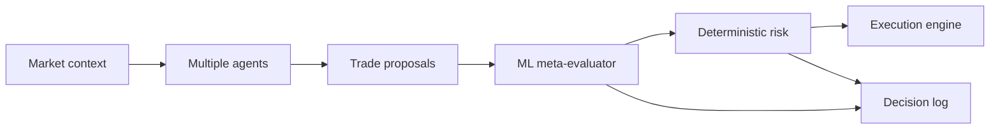

# ML Evaluation And Research Plan

This document explains how to turn live and replay trading decisions into a
machine-learning and research workflow.

## Goal

The ML goal is not to immediately build a model that directly trades.

The first goal is to understand and improve the agents inside the focused AI
infrastructure trading arena POC.

Current product scope as of 2026-08-31:

- first workflow: AI infrastructure / large-cap technology trading arena
- first user: the project owner and portfolio/recruiter viewers who want to
  understand agent trading behavior
- first trade frame: simulated BUY, SELL, and HOLD decisions flowing through
  deterministic risk checks and the C++ order book
- supporting explanation frame: recap/brief under the graph, with add, wait,
  reduce, or research-more interpretation when useful
- first core agent set: AnalystBot, MacroBot, and BearBot across Claude/OpenAI
- parked agents: DegenBot and ContrarianBot remain in code, replay, and sandbox,
  but they are not the serious first live product surface

Questions to answer:

- Which bot/provider combinations produce profitable decisions?
- Which bot/provider combinations are good only in certain market regimes?
- Which prompt versions improve or hurt performance?
- Which evidence features correlate with good decisions?
- Is confidence calibrated?
- Does risk reject bad trades or block good trades?
- Which agents are redundant?
- Which core agents should stay live, be modified, or be reintroduced from the
  parked set?
- Can a meta-model predict when to trust a bot?

The initial ML work should be tested on replay first. Replay gives controlled,
repeatable inputs, so it is the right place to debug labels, features, leakage,
prompt versions, benchmark scoring, and baseline models before treating live
results as meaningful.

Replay used for ML must resemble the live decision environment. Since the bots
currently trade from market/news/RAG context, the first serious ML dataset must
come from news-enriched replay, not price-only replay. Price-only replay can
validate plumbing, but it should not be used to decide which agents are good at
news-driven trading.

After replay-based ML is stable, the system should refresh ML/evaluation reports
on a recurring cadence using newly collected real data. Weekly is a good default
for human review, but the job should be data-aware: if the system only collected
a few decisions in a week, delay decision-grade conclusions until enough new
outcome labels exist.

The next visible product should be the focused trading arena, not another ML
report and not a standalone brief. ML should power trust, risk, benchmark, and
recap context behind the scenes.

## Current V2 Status

As of 2026-08-19, the completed backfilled six-month replay has a v2 research
refresh pipeline and product-facing API/UI:

- dataset: `data/ml/datasets/replay_decisions_v2.csv`
- feature dictionary: `data/ml/datasets/feature_dictionary_v2.md`
- model suite: `data/ml/reports/model_suite_v2.json`
- standings: `data/ml/reports/replay_standings_v2.json`
- human report: `data/ml/reports/replay_research_report_v2.md`
- refresh manifest: `data/ml/reports/refresh_manifest_v2.json`
- endpoint: `GET /evaluation/replay-research?version=v2`
- UI: Six-Month Replay Research panel in `frontend/src/pages/EvalPage.jsx`

The v2 targets include directional correctness, SPY-relative beat-benchmark
labels, large-loss labels, and high-confidence-wrong labels over 1d/3d/7d
horizons. The v2 model suite trains logistic regression, random forest, extra
trees, gradient boosting, and a dummy-majority baseline. Current results are
research-grade, not pruning-grade, because trade labels are still limited and
test splits are small.

Cost note:

- Future replay rows now capture replay token/cost fields when provider usage is
  available.
- The existing six-month v2 replay was recorded before those fields existed, so
  the refreshed v2 cost snapshot correctly reports `0` recorded cost rows and
  `756` missing cost rows.

## Why ML Is Needed

Simple leaderboards are helpful, but they do not explain enough.

Example:

```text
Claude MacroBot made more replay PnL than OpenAI MacroBot.
```

That is useful, but not enough.

ML/research should answer:

```text
Claude MacroBot performed better specifically on high-volatility risk-off days,
when SPY was below its 20-day trend and TLT was up.
```

That second sentence is much more impressive.

## Dataset Philosophy

The raw data should stay raw.

Derived datasets should be generated from logs and replay records.

Raw sources:

- `bot_decisions`
- `execution_orders`
- `execution_fills`
- `decision_outcomes`
- `phase_d_replay_runs`
- `phase_d_replay_decisions`
- RAG documents/chunks
- replay event payloads

Derived ML rows:

```text
one decision at one timestamp, enriched with features and labels
```

Do not mutate raw records for experiments. Generate versioned datasets.

## Replay-First ML Development Loop

Use replay before live data for initial ML development.

Loop:

1. Generate replay events.
2. Verify replay events contain no-lookahead news/evidence context.
3. Run replay matrix.
4. Export replay decisions into a feature table.
5. Create labels from future prices and benchmark returns.
6. Train a simple baseline model.
7. Inspect feature importance and failure cases.
8. Fix feature bugs, leakage, prompt issues, or risk issues.
9. Rerun replay regression.
10. Only then compare against fresh live data.

Why replay first:

- same input can be reused across versions
- cheaper to debug than waiting for live outcomes
- easier to detect regressions
- no-lookahead can be audited
- model/prompt changes can be compared fairly

Every material fix should create a before/after comparison:

- parser fix
- prompt fix
- risk limit change
- evidence guardrail change
- replay scoring change
- ML feature engineering change
- model selection change

The comparison should state:

- baseline replay report
- new replay report
- key metric changes
- cost changes
- whether the change should proceed to live observation

## Recurring Live-Data ML Refresh

The live system should keep collecting real decisions. The ML/evaluation layer
should periodically ask whether recent changes helped.

Recommended recurring jobs:

1. Outcome labeling job:
   - cadence: hourly or daily
   - cost: low
   - purpose: create `1h`, `6h`, `1d`, `7d` labels when decisions become old
     enough

2. Weekly evaluation report:
   - cadence: weekly, or after enough new data
   - suggested threshold: 50 new decisions or 50 new outcome labels
   - purpose: summarize recent live performance

3. ML dataset refresh:
   - cadence: weekly if enough new data, otherwise every two to four weeks
   - trigger immediately after six-month replay completes
   - trigger after material prompt/model/risk/parser changes

4. Baseline model refresh:
   - cadence: after dataset refresh when enough labels changed
   - avoid retraining on tiny weekly changes unless marked exploratory

5. Agent review:
   - cadence: monthly
   - purpose: decide which bots to keep, pause, or adjust

The system should eventually produce an automated report like:

```text
Weekly Evaluation Report
- live decisions collected this week
- due outcomes labeled
- replay regression status for latest version
- win rate by bot/provider
- net after estimated LLM cost
- SPY-relative performance
- risk-blocked winners/losers
- citation and unsupported-trade metrics
- ML model drift or feature importance changes
- recommendation: keep, pause, adjust, or collect more data
```

Do not let weekly automation overfit the project. If the weekly sample is small,
the report should say "not enough new data for a strong conclusion."

## Proposed Dataset Outputs

Recommended layout:

```text
data/
  ml/
    datasets/
      replay_decisions_v1.parquet
      replay_decisions_v1.csv
      live_decisions_v1.parquet
      feature_dictionary_v1.md
    reports/
      baseline_model_v1.json
      agent_pruning_report_v1.md
```

CSV is easy to inspect. Parquet is better for serious analysis if dependencies
are available.

## Feature Groups

### Identity Features

- `decision_id`
- `run_id`
- `mode`: live or replay
- `bot_id`
- `bot_name`
- `base_personality`
- `llm_provider`
- `model`
- `prompt_version`
- `prompt_hash`
- `event_index`
- `as_of_time`

Why:

These let us compare bots, providers, prompt versions, and replay runs fairly.

### Decision Features

- `action`
- `ticker`
- `quantity`
- `limit_price`
- `confidence`
- `speculative`
- `headline_used`
- `reasoning_length`
- `llm_call_made`
- `llm_input_tokens`
- `llm_output_tokens`
- `llm_total_tokens`
- `llm_estimated_cost_usd`

Why:

These explain how expensive and aggressive each decision was.

### Evidence Features

- `evidence_count`
- `evidence_url_count`
- `has_evidence`
- `max_evidence_score`
- `avg_evidence_score`
- `evidence_source_types`
- `evidence_form_types`
- `evidence_age_days`
- `used_sec_filing`
- `used_news`

Why:

These let us answer whether evidence improves outcomes.

### News Context Features

- `headline_count`
- `real_headline_count`
- `synthetic_headline_count`
- `ticker_headline_count`
- `macro_headline_count`
- `earnings_headline_count`
- `filing_headline_count`
- `headline_age_minutes_min`
- `headline_age_minutes_avg`
- `headline_sources`
- `has_real_news`
- `has_synthetic_market_summary`
- `news_context_quality`

Why:

The current bots are news-driven. These features let us measure whether a replay
decision was made with realistic news context and whether bots perform better
when they have real headlines versus generated market summaries.

### Market Features

Per ticker:

- current price
- daily return
- 5-day return
- 20-day return
- rolling volatility
- volume ratio
- gap from previous close
- distance from moving average

Market-wide:

- SPY return
- QQQ return
- TLT return
- GLD return
- risk-on/risk-off flag
- volatility bucket
- trend bucket
- breadth proxy

Why:

These help identify regimes where certain bots work.

### Risk Features

- `risk_checked`
- `risk_approved`
- `risk_reason`
- `estimated_notional`
- `max_order_notional`
- `max_position_notional`
- `short_selling_enabled`
- `would_create_short`
- `risk_blocked`

Why:

Risk is part of the decision system. We need to know whether risk was helpful.

### Execution Features

- `order_id`
- `order_type`
- `fill_count`
- `fill_qty_total`
- `fill_avg_price`
- `slippage`
- `pending_or_filled`

Why:

Eventually we need to distinguish good ideas from executable trades.

### Benchmark Features

- `benchmark_symbol`
- `benchmark_price_at_decision`
- `benchmark_price_at_outcome`
- `benchmark_return`
- `relative_return_vs_benchmark`
- `excess_pnl_vs_benchmark`

Why:

Making money is less impressive if the whole market made more. The project
should compare to SPY/S&P-style baselines.

## Labels

### Directional Labels

- `directional_correct_next_event`
- `directional_return_next_event`
- `intent_mark_pnl_next_event`

Definition:

- BUY is correct if future price is higher.
- SELL is correct if future price is lower.
- HOLD is not scored as a directional trade unless a separate opportunity-cost
  label is added.

### Horizon Labels

For each horizon:

- `return_1h`
- `return_6h`
- `return_1d`
- `return_7d`
- `pnl_1h`
- `pnl_6h`
- `pnl_1d`
- `pnl_7d`
- `profitable_1h`
- `profitable_6h`
- `profitable_1d`
- `profitable_7d`
- `net_after_llm_cost_1h`
- `net_after_llm_cost_6h`
- `net_after_llm_cost_1d`
- `net_after_llm_cost_7d`

### Benchmark Labels

- `beat_spy_1d`
- `beat_spy_7d`
- `excess_return_vs_spy_1d`
- `excess_return_vs_spy_7d`

### Risk Labels

- `risk_saved_loss`
- `risk_blocked_winner`
- `risk_rejection_pnl`

Risk labels are very important because they help tune risk controls.

## First Analysis Before ML

Before training models, run simple analysis.

Tables:

- PnL by bot/provider.
- Directional accuracy by bot/provider.
- PnL by scenario.
- PnL by market regime.
- Citation rate vs PnL.
- Confidence bucket vs win rate.
- Risk rejection reason vs blocked PnL.
- Model cost vs profitable decisions.
- Prompt version vs results.

Charts:

- cumulative intent PnL by bot
- drawdown by bot
- rolling win rate
- replay scenario heatmap
- provider comparison
- confidence calibration curve
- risk-blocked winners/losers

This analysis may already answer many pruning questions without a model.

## Baseline Models

Start simple.

### Model 1: Logistic Regression

Task:

```text
Predict whether a trade will be directionally correct.
```

Why:

- interpretable
- fast
- good baseline
- coefficients explain feature direction

### Model 2: Random Forest

Task:

```text
Predict profitable vs unprofitable trade.
```

Why:

- handles nonlinear interactions
- feature importance is useful
- robust baseline

### Model 3: Gradient Boosted Trees

Task:

```text
Predict expected PnL or probability of beating SPY.
```

Why:

- strong tabular baseline
- works well for mixed numeric/categorical features

### Model 4: Meta-Router

Task:

```text
Given current market state and agent proposal, predict whether to accept,
reject, or route to another agent.
```

This is the most useful future model.

The meta-router should not replace risk. It should sit before or beside
execution as a decision-quality filter.

## What Not To Do Yet

Do not start with:

- deep reinforcement learning
- transformer models over raw text
- direct autonomous real-money trading
- options trading models
- minute-level high-frequency prediction
- expanding every sector at once
- treating DegenBot or ContrarianBot as primary live POC agents
- adding more model families before improving labels and brief usability

Reason:

The dataset is not yet large or clean enough, and the product needs a sharper
user-facing workflow. We need strong evaluation, clear labels, and a useful
brief before adding more model complexity.

## Avoiding Leakage

This is critical.

Leakage means the model gets information from the future.

Bad:

- using tomorrow's close as a feature
- using future outcome text in event summaries
- using news published after the event timestamp
- random train/test split over time series
- letting replay RAG retrieve future documents

Good:

- features only from time `T` or earlier
- labels from time `T + horizon`
- time-based train/test split
- walk-forward validation
- as-of RAG retrieval

## Train/Test Split

Use time-based splits.

Example:

Training:

```text
2026-02-18 through 2026-06-30
```

Validation:

```text
2026-07-01 through 2026-07-31
```

Test:

```text
2026-08-01 through 2026-08-18
```

For later:

- walk-forward validation
- expanding window
- rolling window

Do not use random splits as the main result. Random splits can leak regime
information and overstate performance.

## Metrics

Classification:

- accuracy
- precision
- recall
- F1
- ROC AUC
- calibration

Trading:

- total PnL
- average PnL per decision
- average PnL per trade
- win rate
- profit factor
- max drawdown
- Sharpe-style ratio
- turnover
- exposure
- benchmark excess return
- cost-adjusted return

Agent evaluation:

- citation rate
- unsupported trade rate
- speculative trade rate
- risk rejection rate
- risk-blocked winner rate
- cost per profitable decision
- confidence calibration

## Dataset Exporter Plan

Add:

```text
scripts/export_ml_dataset.py
```

Command shape:

```powershell
python scripts/export_ml_dataset.py `
  --db $env:DATABASE_URL `
  --mode replay `
  --input-fingerprint 913a986d59ffa5c7de375b5cfe0507c994b821d7550f59a2cb8c3602aee14329 `
  --benchmark SPY `
  --output data/ml/datasets/replay_decisions_v1.csv `
  --dictionary data/ml/datasets/feature_dictionary_v1.md `
  --summary data/ml/datasets/replay_decisions_v1.summary.json
```

Exporter responsibilities:

- load replay runs and decisions
- flatten event payload JSON
- join benchmark prices
- flatten news/headline metadata
- count real versus synthetic headlines
- flag low-news-context decisions
- compute feature columns
- compute label columns
- include model metadata
- include prompt metadata
- write CSV/Parquet
- write feature dictionary
- write summary report

Implementation status as of 2026-08-18:

- `scripts/export_ml_dataset.py` exists for replay mode.
- `simulator/ml_dataset.py` contains the testable exporter logic.
- The first completed six-month replay export is:
  `data/ml/datasets/replay_decisions_v1.csv`.
- The first feature dictionary is:
  `data/ml/datasets/feature_dictionary_v1.md`.
- The first summary is:
  `data/ml/datasets/replay_decisions_v1.summary.json`.
- Export summary:
  - 756 decision rows.
  - 213 trade rows.
  - 211 next-event directional labels.
  - aggregate directional accuracy: `0.4834`.
  - aggregate beat-SPY rate: `0.4502`.
- Current caveat: this exporter is replay-first. Live-decision export should be
  added later without silently combining live and replay data.

## Baseline Training Script Plan

Add:

```text
scripts/train_baseline_evaluator.py
```

Command shape:

```powershell
python scripts/train_baseline_evaluator.py `
  --dataset data/ml/datasets/replay_decisions_v1.csv `
  --target directional_correct_next_event `
  --model logistic_regression `
  --time-column as_of_time `
  --report data/ml/reports/baseline_logreg_directional_correct_v1.json
```

Outputs:

- train/validation/test metrics
- feature importance or coefficients
- confusion matrix
- calibration metrics
- agent-level performance table
- recommendation summary

Implementation status as of 2026-08-18:

- `scripts/train_baseline_evaluator.py` exists.
- `simulator/baseline_model.py` contains a dependency-free logistic-regression
  baseline with a time-ordered train/validation/test split and leakage-column
  guardrails.
- First report:
  `data/ml/reports/baseline_logreg_directional_correct_v1.json`.
- First metrics:
  - train: 147 rows, `0.7347` accuracy.
  - validation: 31 rows, `0.4839` accuracy.
  - test: 33 rows, `0.4242` accuracy.
- Interpretation: this proves the model pipeline, but the first model is not
  strong enough for pruning decisions. Use it to guide the next analysis, not as
  an authority.

## Weekly Evaluation Script Plan

Add:

```text
scripts/run_weekly_evaluation_report.py
```

Command shape:

```powershell
python scripts/run_weekly_evaluation_report.py `
  --db $env:DATABASE_URL `
  --since 2026-08-11 `
  --until 2026-08-18 `
  --benchmark SPY `
  --min-new-outcomes 50 `
  --output data/ml/reports/weekly_eval_2026-08-18.md `
  --json-output data/ml/reports/weekly_eval_2026-08-18.json
```

Responsibilities:

- count new live decisions
- count new outcome labels
- summarize live performance by bot/provider
- summarize replay regression status for the current version if available
- compare against the prior weekly report
- include benchmark-relative metrics when available
- include estimated LLM cost
- identify weak signals and possible regressions
- state whether there is enough data to make a decision

This script should not call LLM providers by default. It should mostly read
stored data and write reports.

## Fix Validation And ML Refresh

When a bug fix or prompt change lands, do not wait a full week before checking
it.

Run this immediate sequence:

1. Unit tests.
2. Replay regression suite.
3. Replay comparison against prior version.
4. Dataset export refresh if replay data changed.
5. Baseline ML report refresh if enough labels changed.
6. Mark the change as ready for live observation only if replay results are
   acceptable.

Then, during the next weekly live-data report, compare real outcomes under the
new version against the previous version.

## Agent Pruning Report

After enough replay data, generate:

```text
data/ml/reports/agent_pruning_report_v1.md
```

It should answer:

- Which core agents should remain live?
- Which core agents should be modified?
- Which parked agents are worth reintroducing through replay or sandbox?
- Which agents are redundant?
- Which bots are too expensive?
- Which bots have high unsupported trade rates?
- Which bots have good intent but get blocked by risk?
- Which bots work only in certain regimes?
- Which prompts should be changed?

Suggested categories:

- Keep
- Keep but modify
- Pause
- Remove from live rotation
- Run only in certain regimes

## How ML Should Influence The Product

The ML layer should produce recommendations first.

Then it can become a meta-router.

Final architecture:



The meta-evaluator can say:

- accept this decision
- reject this decision
- lower size
- prefer another agent
- require more evidence
- route macro days to MacroBot
- route selloff days to BearBot
- flag cases where a parked ContrarianBot replay experiment may be worth running

But deterministic risk still remains mandatory.

## Research Questions To Track

Agent behavior:

- Does AnalystBot over-hold?
- Does BearBot perform only in selloffs?
- Does MacroBot correctly ignore company-specific news?
- If ContrarianBot is reintroduced in replay, does it work after extreme moves
  or just fight trends?
- If DegenBot is reintroduced in sandbox/replay, is it useful as a high-beta
  signal or mostly noise?

Provider behavior:

- Is Claude more cautious?
- Is OpenAI more responsive after parser fix?
- Which provider cites evidence more reliably?
- Which provider has better cost-adjusted performance?

Prompt behavior:

- Does stricter evidence improve quality or reduce trade count too much?
- Does lower reasoning effort preserve decisions while reducing cost?
- Do prompts produce stable JSON?

Risk behavior:

- Does risk mostly save losses?
- Does risk block too many winners?
- Are max notional limits too strict?
- Is short-selling disabled/enabled at the right time?

Market behavior:

- Which bots do well in risk-off regimes?
- Which bots do well in growth rallies?
- Which bots do well in rate-shock scenarios?
- Which bots beat SPY after costs?

## Definition Of ML-Ready

The project is ML-ready when:

- six-month replay dataset exists
- every decision has model/prompt metadata
- benchmark series is included
- labels are computed without leakage
- export script creates a stable dataset
- feature dictionary exists
- baseline analysis runs reproducibly
- first pruning report exists
- replay-regression reports exist for material fixes
- weekly/data-threshold live-data evaluation reports exist
