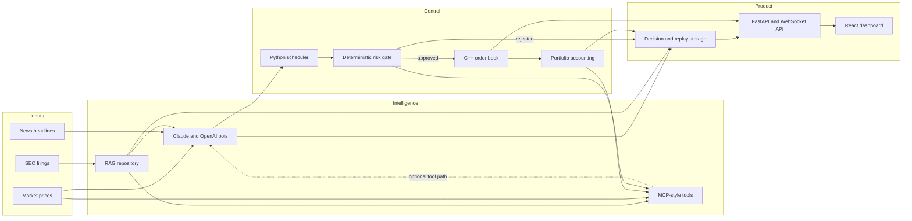
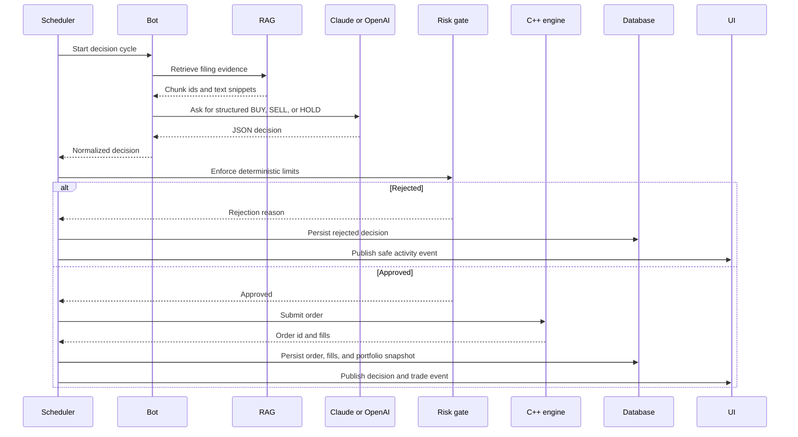
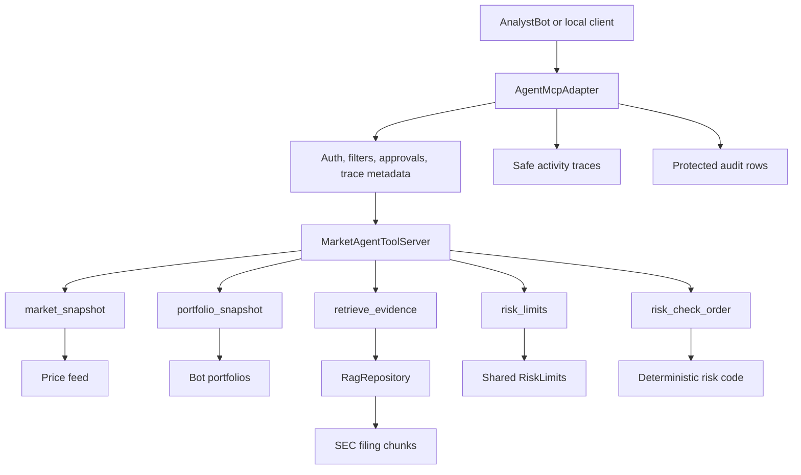
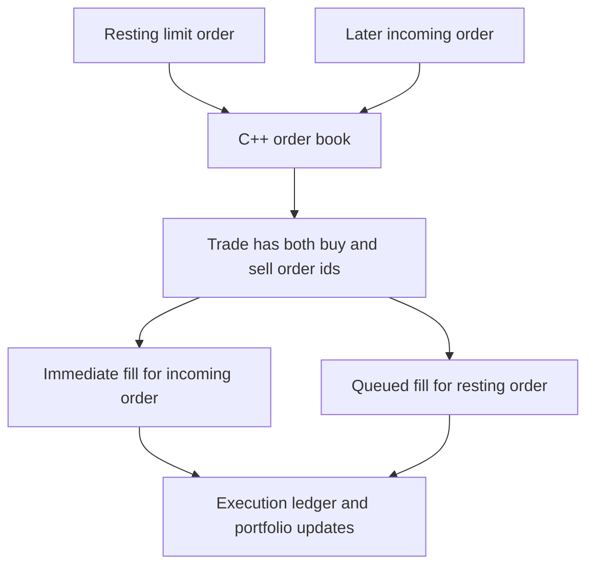

# Market Simulation Platform Demo Presentation

Use this as the public-facing architecture walkthrough after showing the live
site. It is written to be easy to talk over on screen.

## The 20-Second Story

Market Simulation Platform is an AI trading arena. Claude and OpenAI run the
same five trading personalities, read the same market data and SEC evidence,
pass through the same deterministic risk gate, and trade inside the same C++
limit order book. The app records decisions, fills, evidence, and replay
metrics so the comparison is inspectable instead of hand-wavy.

This is simulated trading only. It does not place real orders.

## Best Live Tour Order

1. Show the homepage and leaderboard.
2. Show a bot detail view and recent decisions.
3. Show the order book so the market mechanics feel real.
4. Show behavior and evaluation so the model comparison feels measured.
5. Open this file and explain how the system is wired together.

## System At A Glance

The key point: the models can suggest, but only deterministic Python code can
submit an order to the engine.

<strong>Expand: One Decision From Prompt To Fill</strong>

<strong>Expand: MCP Layer, Client To Host To Tools</strong>

How to explain it:

- The client is either AnalystBot in tool mode or a local MCP client.
- The host is the adapter plus the in-process tool server.
- The tools do not bypass system rules.
- `retrieve_evidence` reaches into the same RAG store used by the direct prompt
  path.
- `risk_check_order` is only a preflight. The scheduler repeats the real check
  before execution.

```mermaid
flowchart LR
    Poller[SEC poller] --> Detect[Find new filings]
    Detect --> Fetch[Fetch 10-K, 10-Q, and 8-K HTML]
    Fetch --> Clean[Normalize text]
    Clean --> Dedupe[Deduplicate by accession, URL, then hash]
    Dedupe --> Chunk[Create bounded chunks]
    Chunk --> Embed[Generate embeddings]
    Embed --> Store[Store documents and chunks]
    Store --> Retrieve[Vector search with keyword fallback]
    Retrieve --> Prompt[Send evidence into bot prompt]
    Prompt --> Persist[Persist cited chunk ids and source URLs]
```

<strong>Expand: RAG Pipeline</strong>

Why it matters:

- The evidence is dateable, so replay can enforce no-lookahead behavior.
- The model cites chunk ids instead of inventing sources.
- Reviewers can open the exact filing snippet behind a decision.

<strong>Expand: Execution And Passive Fill Attribution</strong>

Why it matters:

- It keeps both counterparties correct.
- It keeps portfolio state, replay results, and the UI in sync.
- It is one of the places where the native engine and Python orchestration have
  to agree exactly.

## What This Demonstrates

- Market structure: price-time priority, limit and market orders, fills,
  liquidity, and PnL.
- AI systems design: structured model output, evidence retrieval, tool access,
  and deterministic safety boundaries.
- Full-stack engineering: C++, Python, FastAPI, SQLAlchemy, React, Docker, and
  deployment packaging.
- Evaluation discipline: replay, no-lookahead RAG, citations, risk rejection
  rates, and provider comparisons on the same inputs.

## Good Closing Line

The interesting part is not just "an LLM made a trade." The interesting part is
that every step around the model is inspectable: what it saw, what evidence it
used, what the risk gate allowed, how the engine filled it, and how the result
was measured.

## Related Docs

- [Repository README](../../README.md)
- [Recruiter Overview](RECRUITER_OVERVIEW.md)
- [MCP And Agent Integration](../architecture/MCP.md)
- [Deployment Runbook](../operations/DEPLOYMENT.md)
- [Release And Smoke Checklist](../operations/RELEASE.md)
